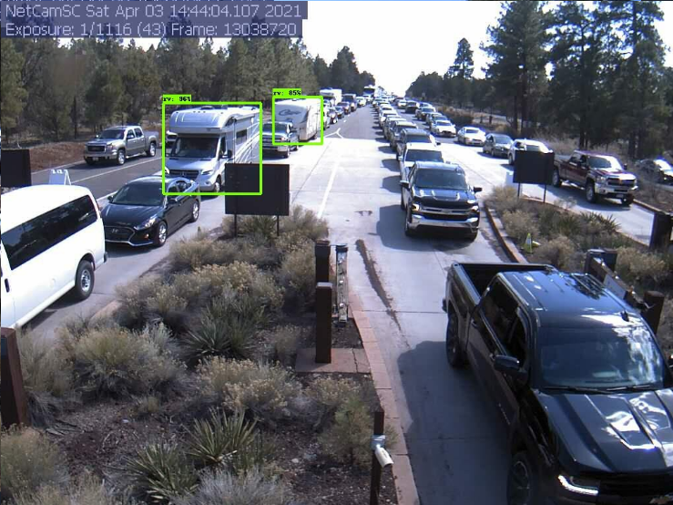
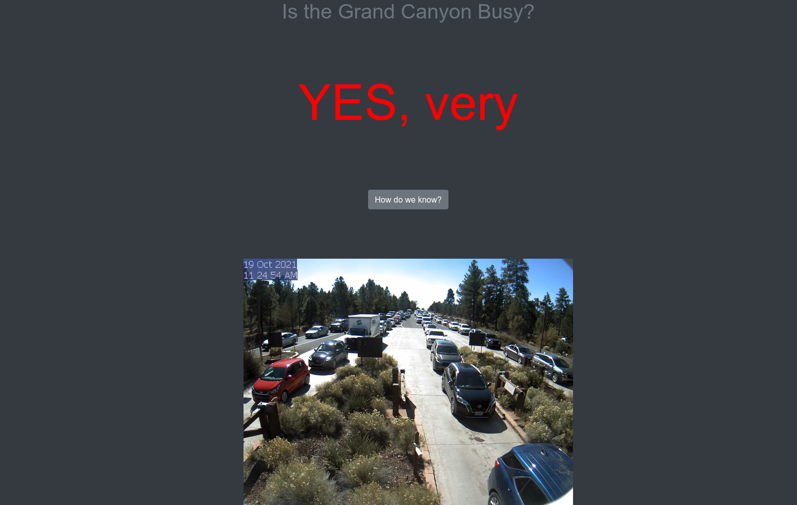
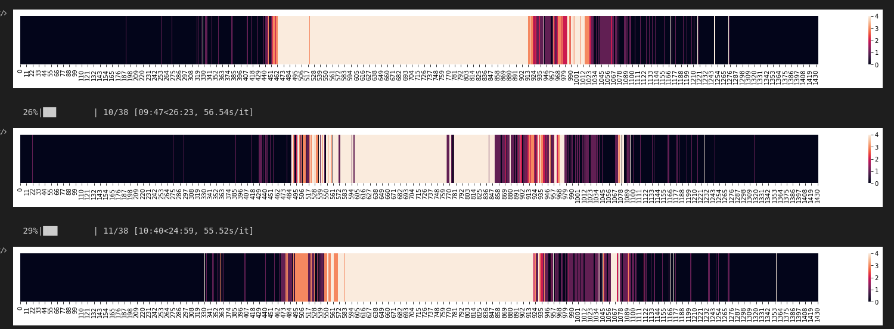

# Grand Canyon Traffic Detection - Is The Grand Canyon Busy?

This repository contains a taste of the code involved in my Grand Canyon traffic detection project.

## Origin Story:  

One weekend in March 2021 I decided I wanted to drive up to the Grand Canyon (from Phoenix). The views are breathtaking *(I strongly recommend it if you've never been)*, so even though I had been a couple of times before, I was excited about the trip. I decided it would be worthwhile to determine how busy the park was, but I was unable to find any indication online, except for a webcam displaying the traffic at the park entrance. Upon realizing this webcam frame was updated once every minute, I delayed leaving and instead wrote a quick python script to begin scraping this frame -- I decided it would be fun to build a dataset with the intention of creating a simple site that could tell a visitor how busy the park was at any given time.

## The Initial Approach:  

I decided the first and easiest task would be to simply classify the images into a few traffic-density categories. After some image labelling *(I gained such an appreciation for clean datasets and the work that goes into creating them during this process)* which included traffic classification and some bounding box drawing, I developed a simple Keras CNN model to predict the category and fine-tuned an SSD ResNet50 object detector model using core TensorFlow.   
Here is an example output of the RV detector model:

Once I had a model that performed reasonably well on the dataset *(88% accuracy -- there is a confusion matrix in the `traffic_level_classfier.ipynb` notebook with more on the results)*, I quickly threw together a simple Flask app that:
- Restores the model
- Grabs the image from the Grand Canyon website
- Preps the image for the model
- Uses the model for inference
- Uses Bootstrap v4.4.1 (https://getbootstrap.com/) CSS file for some quick (not included here)
- has a fun button to display the image, so you can verify if the model was right.    

The button was actually more so a test of the "revealing hidden content" functionality, as I'd like to also display further predictions and analysis such as these full-day traffic heatmaps (prototypes, they'll be prettier):

## Under Development

The first iteration of the Flask app as well as some prototyping Jupyter notebooks are included here for demo purposes. I'm currently developing this project further and intend to on adding things such as:
- Using time series data to make future predictions of traffic
- Determine trends at a daily, weekly, monthly and yearly level
- Include weather data
- More complete object detection functionality and utilization of output (vehicle counts, etc.)
- and more!

before actually hosting the site somewhere, purely for fun.

